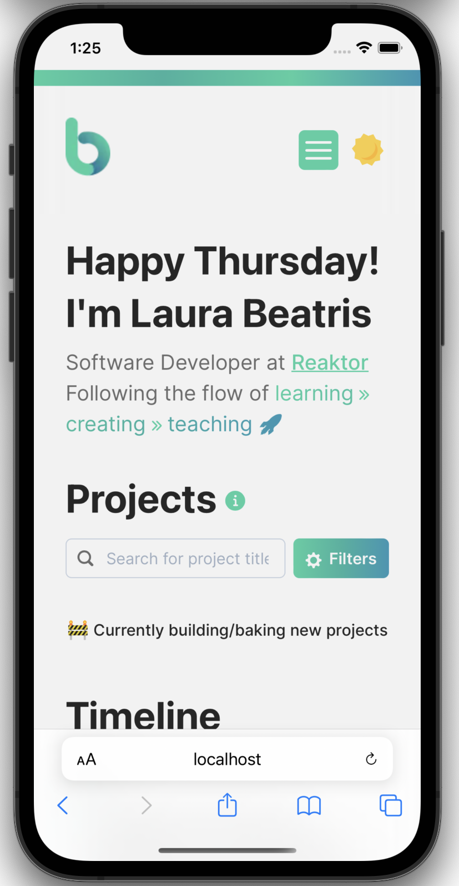
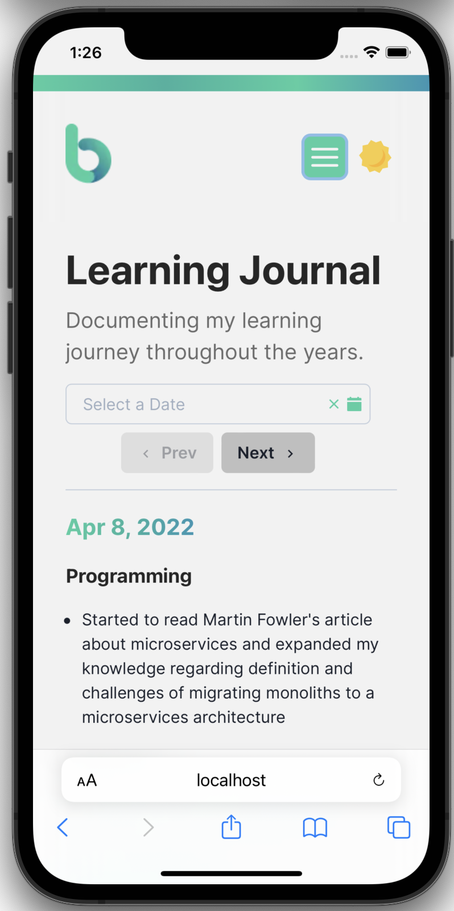

<p align="left">
   
</p>

# laurabeatris.com

[](https://github.com/LauraBeatris)
[](#)
[](https://github.com/LauraBeatris/laurabeatris.com/stargazers)

---
<p align="center">
   
   
</p>

<p align="center">
   <a href="https://laurabeatris.com">Go check it out 🎉</a>
</p>

---

# :pushpin: Table of Contents

* [Running Locally](#construction_worker-running-locally)
* [FAQ](#postbox-faq)
* [Issues](#bug-issues)
* [Contributing](#tada-contributing)

## :construction_worker: Running Locally

Disclaimer: This project fetches data from my personal [GraphCMS](https://graphcms.com/) workspace, thus it's necessary to define the CMS endpoint as a environment variable, otherwise it's not possible to fully execute the scripts bellow

#### Clone repository
```bash
git clone https://github.com/LauraBeatris/laurabeatris.com.git
```

#### Define environment variables
```bash
cp .env.local.example .env.local
```

#### Install dependencies & execute web application in development mode
```bash
yarn
yarn dev
```

Define the environment variables by creating a .env.local file similar to [.env.local.example](https://github.com/LauraBeatris/laurabeatris.com/blob/master/.env.local.example)

# :postbox: Faq

**Question:** What are the technologies used in this project?

**Answer:** [Next.js](https://nextjs.org/), [Chakra UI](https://chakra-ui.com/) and [GraphCMS](https://graphcms.com/)

**Question** Why Next.js instead of other frameworks of React out there?

**Answer** I chose Next.js in order to opt out for different rendering strategies

# :bug: Issues

Feel free to **file a new issue** with a respective title and description. If you already found a solution to your problem, **I would love to review your pull request**!

# :tada: Contributing

Check out the [contributing](https://github.com/LauraBeatris/laurabeatris.com/blob/master/CONTRIBUTING.md) page to see the best places to file issues, start discussions and begin contributing
